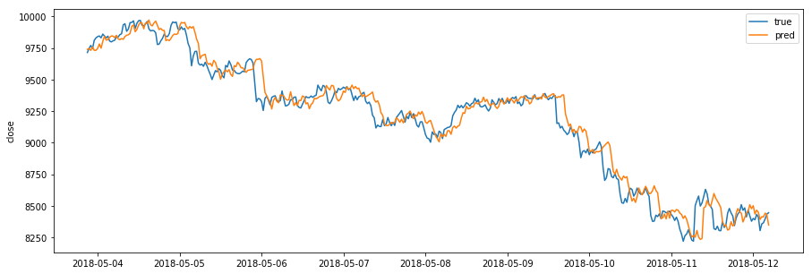
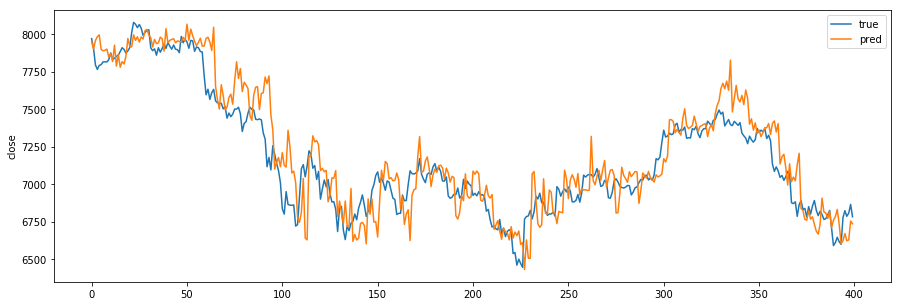

# Problem : neural network mimics previous values instead of forecasting  

30분 단위의 가격정보의 4 timestamp 이후의 가격(2시간 이후의 가격)을 예측한다고 했을 때, 이전 시점의 가격 패턴을 그대로 나타나는 문제가 있다.  
  

Input dimension이 Transpose된 것이 원인이라고 생각하였으나, Input을 변형해서 테스트한 결과도 동일하고, 아래의 랜덤포래스트 결과에서도 이전 시점의 패턴이 그대로 나오는 결과로 보아, 시계열 데이터 같은 Sequence data를 학습할 때 나오는 구조적인 문제로 생각되고, 데이터 전처리 기법을 좀 더 연구할 필요가 있다.  

